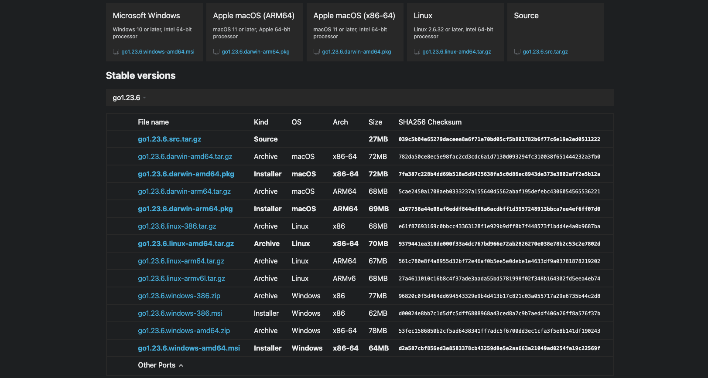
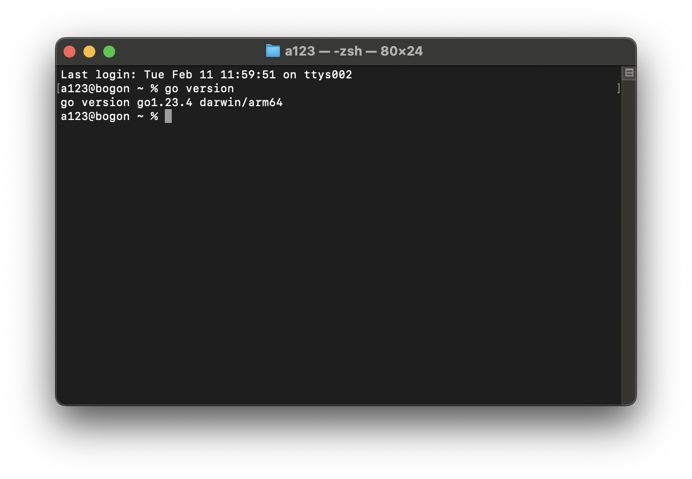

# abstract
由于笔者工作与开发关系不大，因此已有许久没有复习过golang的语法和用例，最近在对运维平台的梳理过程中，想要用golang来做一下后端的实现，奈何基础知识基本上忘光了，连ai写都写不下去，故此开始复习一下相关内容，顺便整理一下之前杂乱的笔记。  

# 0.从零开始搭建Go环境

## 0.1 安装Go
### 下载

#### 下载地址

Go官网下载地址：[https://golang.org/dl/](https://golang.org/dl/)

Go官方镜像站（推荐）：[https://golang.google.cn/dl/](https://golang.google.cn/dl/)

#### 版本的选择

Windows平台和Mac平台推荐下载可执行文件版，Linux平台下载压缩文件版。

笔者使用的是macos平台，因此下载的是go1.23.6.darwin-amd64.pkg这个版本。



#### 安装

双击下载的pkg文件，按照提示安装即可。

#### 配置环境变量

笔者使用的是macos平台，因此需要配置环境变量。

在终端输入以下命令：

```bash
echo 'export PATH="$PATH:/usr/local/go/bin"' >> ~/.zshrc
source ~/.zshrc
```

配置完成后，可以在终端输入go version查看是否安装成功。



#### 运行第一个go程序

这里可以参考[Go官方教程](https://tour.golang.org/welcome/1)

笔者这里选择的是[Hello, World!](https://tour.golang.org/welcome/1)

在ide中新建一个go文件，文件名可以为hello.go，文件内容如下：

```go
package main

func main() {
	fmt.Println("Hello, World!")
}
```

在终端输入以下命令：

```bash
go run hello.go
```

这样就能看到类似如下的输出：

```bash
Hello, World!
```

至此，Go环境就配置完成了。

# 1.依赖管理

## 为什么需要依赖管理

最早的时候，Go所依赖的所有的第三方库都放在GOPATH这个目录下面。这就导致了同一个库只能保存一个版本的代码。如果不同的项目依赖同一个第三方的库的不同版本，应该怎么解决？

## godep

Go语言从v1.5开始开始引入`vendor`模式，如果项目目录下有vendor目录，那么go工具链会优先使用`vendor`内的包进行编译、测试等。

`godep`是一个通过vender模式实现的Go语言的第三方依赖管理工具，类似的还有由社区维护准官方包管理工具`dep`。

### 安装

执行以下命令安装`godep`工具。

```go
go get github.com/tools/godep
```

### 基本命令

安装好godep之后，在终端输入`godep`查看支持的所有命令。

```bash
godep save     将依赖项输出并复制到Godeps.json文件中
godep go       使用保存的依赖项运行go工具
godep get      下载并安装具有指定依赖项的包
godep path     打印依赖的GOPATH路径
godep restore  在GOPATH中拉取依赖的版本
godep update   更新选定的包或go版本
godep diff     显示当前和以前保存的依赖项集之间的差异
godep version  查看版本信息
```

使用`godep help [command]`可以看看具体命令的帮助信息。

### 使用godep

在项目目录下执行`godep save`命令，会在当前项目中创建`Godeps`和`vender`两个文件夹。

其中`Godeps`文件夹下有一个`Godeps.json`的文件，里面记录了项目所依赖的包信息。 `vender`文件夹下是项目依赖的包的源代码文件。

### vender机制

Go1.5版本之后开始支持，能够控制Go语言程序编译时依赖包搜索路径的优先级。

例如查找项目的某个依赖包，首先会在项目根目录下的`vender`文件夹中查找，如果没有找到就会去`$GOAPTH/src`目录下查找。

### godep开发流程

1. 保证程序能够正常编译
2. 执行`godep save`保存当前项目的所有第三方依赖的版本信息和代码
3. 提交Godeps目录和vender目录到代码库。
4. 如果要更新依赖的版本，可以直接修改`Godeps.json`文件中的对应项

## go module

`go module`是Go1.11版本之后官方推出的版本管理工具，并且从Go1.13版本开始，`go module`将是Go语言默认的依赖管理工具。

### GO111MODULE

要启用`go module`支持首先要设置环境变量`GO111MODULE`，通过它可以开启或关闭模块支持，它有三个可选值：`off`、`on`、`auto`，默认值是`auto`。

1. `GO111MODULE=off`禁用模块支持，编译时会从`GOPATH`和`vendor`文件夹中查找包。
2. `GO111MODULE=on`启用模块支持，编译时会忽略`GOPATH`和`vendor`文件夹，只根据 `go.mod`下载依赖。
3. `GO111MODULE=auto`，当项目在`$GOPATH/src`外且项目根目录有`go.mod`文件时，开启模块支持。

简单来说，设置`GO111MODULE=on`之后就可以使用`go module`了，以后就没有必要在GOPATH中创建项目了，并且还能够很好的管理项目依赖的第三方包信息。

使用 go module 管理依赖后会在项目根目录下生成两个文件`go.mod`和`go.sum`。

### GOPROXY

Go1.11之后设置GOPROXY命令为：

```bash
export GOPROXY=https://goproxy.cn
```

Go1.13之后`GOPROXY`默认值为`https://proxy.golang.org`，在国内是无法访问的，所以十分建议大家设置GOPROXY，这里我推荐使用[goproxy.cn](https://studygolang.com/topics/10014)。

```bash
go env -w GOPROXY=https://goproxy.cn,direct
```

### go mod命令

常用的`go mod`命令如下：

```
go mod download    下载依赖的module到本地cache（默认为$GOPATH/pkg/mod目录）
go mod edit        编辑go.mod文件
go mod graph       打印模块依赖图
go mod init        初始化当前文件夹, 创建go.mod文件
go mod tidy        增加缺少的module，删除无用的module
go mod vendor      将依赖复制到vendor下
go mod verify      校验依赖
go mod why         解释为什么需要依赖
```

### go.mod

go.mod文件记录了项目所有的依赖信息，其结构大致如下：

```sh
module github.com/Q1mi/studygo/blogger

go 1.12

require (
	github.com/DeanThompson/ginpprof v0.0.0-20190408063150-3be636683586
	github.com/gin-gonic/gin v1.4.0
	github.com/go-sql-driver/mysql v1.4.1
	github.com/jmoiron/sqlx v1.2.0
	github.com/satori/go.uuid v1.2.0
	google.golang.org/appengine v1.6.1 // indirect
)
```

其中，

- `module`用来定义包名
- `require`用来定义依赖包及版本
- `indirect`表示间接引用

#### 依赖的版本

go mod支持语义化版本号，比如`go get foo@v1.2.3`，也可以跟git的分支或tag，比如`go get foo@master`，当然也可以跟git提交哈希，比如`go get foo@e3702bed2`。关于依赖的版本支持以下几种格式：

```go
gopkg.in/tomb.v1 v1.0.0-20141024135613-dd632973f1e7
gopkg.in/vmihailenco/msgpack.v2 v2.9.1
gopkg.in/yaml.v2 <=v2.2.1
github.com/tatsushid/go-fastping v0.0.0-20160109021039-d7bb493dee3e
latest
```

#### replace

在国内访问golang.org/x的各个包都需要翻墙，你可以在go.mod中使用replace替换成github上对应的库。

```go
replace (
	golang.org/x/crypto v0.0.0-20180820150726-614d502a4dac => github.com/golang/crypto v0.0.0-20180820150726-614d502a4dac
	golang.org/x/net v0.0.0-20180821023952-922f4815f713 => github.com/golang/net v0.0.0-20180826012351-8a410e7b638d
	golang.org/x/text v0.3.0 => github.com/golang/text v0.3.0
)
```

### go get

在项目中执行`go get`命令可以下载依赖包，并且还可以指定下载的版本。

1. 运行`go get -u`将会升级到最新的次要版本或者修订版本(x.y.z, z是修订版本号， y是次要版本号)
2. 运行`go get -u=patch`将会升级到最新的修订版本
3. 运行`go get package@version`将会升级到指定的版本号version

如果下载所有依赖可以使用`go mod download` 命令。

### 整理依赖

我们在代码中删除依赖代码后，相关的依赖库并不会在`go.mod`文件中自动移除。这种情况下我们可以使用`go mod tidy`命令更新`go.mod`中的依赖关系。

### go mod edit

#### 格式化

因为我们可以手动修改go.mod文件，所以有些时候需要格式化该文件。Go提供了一下命令：

```bash
go mod edit -fmt
```

#### 添加依赖项

```bash
go mod edit -require=golang.org/x/text
```

#### 移除依赖项

如果只是想修改`go.mod`文件中的内容，那么可以运行`go mod edit -droprequire=package path`，比如要在`go.mod`中移除`golang.org/x/text`包，可以使用如下命令：

```bash
go mod edit -droprequire=golang.org/x/text
```

关于`go mod edit`的更多用法可以通过`go help mod edit`查看。

## 在项目中使用go module

### 既有项目

如果需要对一个已经存在的项目启用`go module`，可以按照以下步骤操作：

1. 在项目目录下执行`go mod init`，生成一个`go.mod`文件。
2. 执行`go get`，查找并记录当前项目的依赖，同时生成一个`go.sum`记录每个依赖库的版本和哈希值。

### 新项目

对于一个新创建的项目，我们可以在项目文件夹下按照以下步骤操作：

1. 执行`go mod init 项目名`命令，在当前项目文件夹下创建一个`go.mod`文件。
2. 手动编辑`go.mod`中的require依赖项或执行`go get`自动发现、维护依赖。